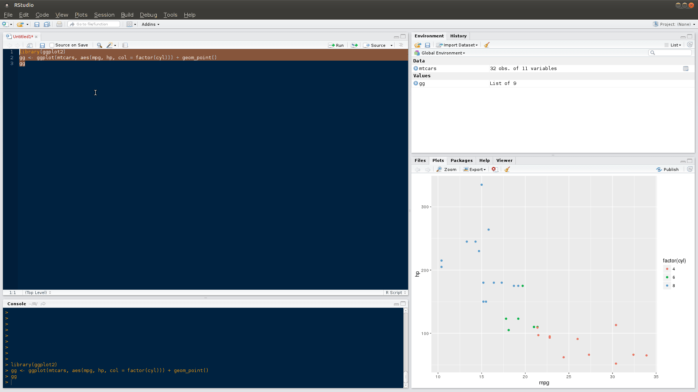

ggThemeAssist
==============
[](http://cran.rstudio.com/package=ggThemeAssist) [](http://www.r-pkg.org/pkg/ggThemeAssist)


**ggThemeAssist** is a RStudio-Addin that uses the [`rstudioapi`](https://github.com/rstudio/rstudioapi) package and provides a GUI for editing [`ggplot2`](https://github.com/hadley/ggplot2) themes. 

For a full list of features see [`NEWS`](./NEWS.md).


Installation
------------

Please be aware that you need the **most recent release of RStudio** (v0.99.878 or later). Additionally, **ggThemeAssist** depends on [`shiny`](https://github.com/rstudio/shiny) and [`miniUI`](https://github.com/rstudio/miniUI).

#### Install from Github
You can install the latest version of **ggThemeAssist** from Github using the [`devtools`](https://github.com/hadley/devtools) package:
```r
if (!requireNamespace("devtools", quietly = TRUE))
  install.packages("devtools")

devtools::install_github("calligross/ggthemeassist")
```

#### Install from CRAN

The first stable version of **ggThemeAssist**, v0.1.0, is now available on CRAN:
```r
install.packages("ggThemeAssist")
```

Usage
------------
After installing, **ggThemeAssist** is available in the Addins menu within RStudio. 

To edit `ggplot2` themes, just highlight a `ggplot2` object in your current script and run the Addin from the Addins menu. **ggplot2** will analyze your current plot, update its defaults to your current specification and give you a preview. Use the input widgets to get your ideas into shape. After terminating **ggThemeAssist** a character string containing your desired changes in standard `ggplot2` notation is inserted in your script. Re-running your script now produces the plot you just configured using **ggThemeAssist**.



