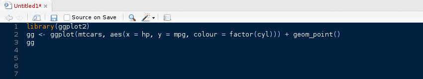

ggplot Theme Assistant
==============

Please be aware that this addin is under heavy developement. At the moment following features are supported:

* Set title for the plot, the axes and the legend (`colour` & `fill`)
* Alter text, lines and ticks of the axes
* Change appearance of the plot panel and alter the major and minor grid
* Set the legend position and change text, panel, background and keys of the legend

When done, a string is returned with only those theme elements which have been altered:




Installation
------------

Please be aware that you need the **most recent release of RStudio** (v0.99.878 or later).

First, ensure that you have the latest versions of
[htmltools](https://github.com/rstudio/htmltools),
[shiny](https://github.com/rstudio/shiny), and
[miniUI](https://github.com/rstudio/miniUI);
then install this package.

```r
if (!requireNamespace("devtools", quietly = TRUE))
  install.packages("devtools")

devtools::install_github("calligross/ggthemeassist")
```

A CRAN package will follow as soon as ggThemeAssist left the current early stage of development.

Usage
------------
Just select a ggplot object with your cursor and start the addin.


News
------------
* the UI was considerably improved
* ggThemeAssist now supports `legend.position = c(x,y)`
* Added support for plot.background

