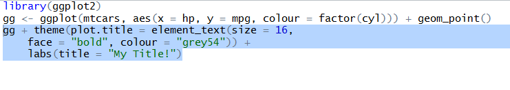
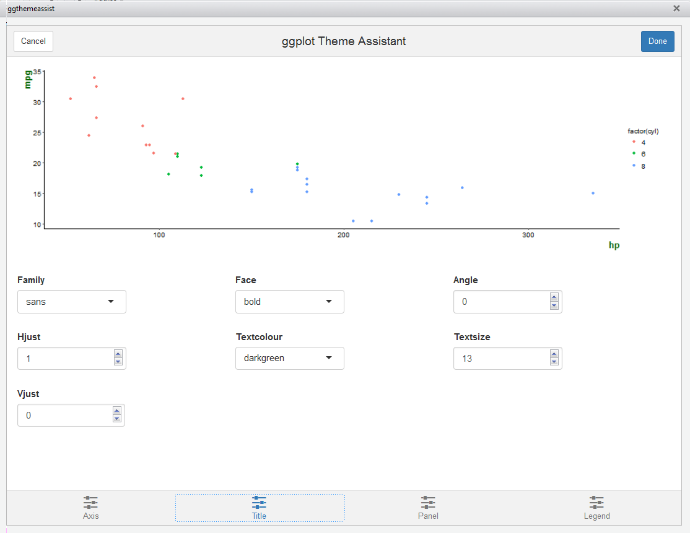

ggplot Theme Assistant
==============

Please be aware that this addin is under heavy developement. At the moment it is possible to alter the theme for:

* Change axis labels and titles
* Plot.title
* axis.text, axis.line, axis.ticks and axis.title
* panel.background, panel.grid.major and panel.grid.minor
* legend.text, legend.title, legend.background, legend.key, legend.position and legend.direction

When done, a string is returned with only the elements which have been altered:



The UI is at the moment less apealing and will be covered in the near future.

Installation
------------
First, ensure that you have the latest versions of
[htmltools](https://github.com/rstudio/htmltools),
[shiny](https://github.com/rstudio/shiny), and
[miniUI](https://github.com/rstudio/miniUI);
then install this package.

```r
if (!requireNamespace("devtools", quietly = TRUE))
  install.packages("devtools")

devtools::install_github("calligross/ggthemeassist")
```

Usage
------------
Just select a ggplot object with your cursor and start the addin.


